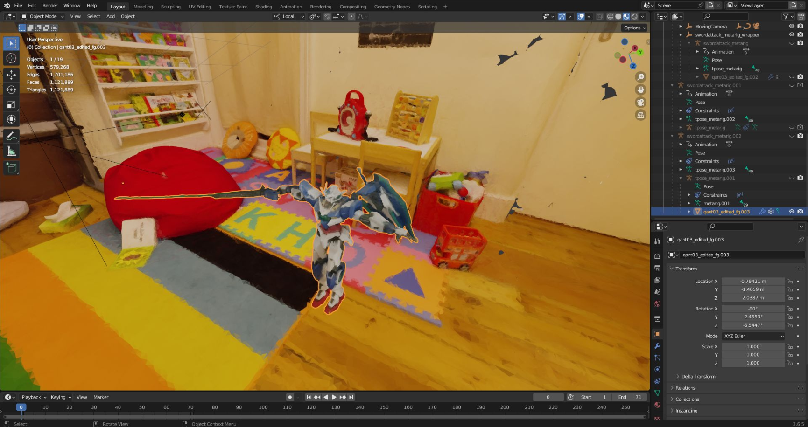

<div align="center">

# SuGaR: Surface-Aligned Gaussian Splatting for Efficient 3D Mesh Reconstruction and High-Quality Mesh Rendering

<font size="4">
CVPR 2024
</font>
<br>

<font size="4">
<a href="https://anttwo.github.io/" style="font-size:100%;">Antoine Guédon</a>&emsp;
<a href="https://vincentlepetit.github.io/" style="font-size:100%;">Vincent Lepetit</a>&emsp;
</font>
<br>

<font size="4">
LIGM, Ecole des Ponts, Univ Gustave Eiffel, CNRS
</font>

| <a href="https://anttwo.github.io/sugar/">Webpage</a> | <a href="https://arxiv.org/abs/2311.12775">arXiv</a> | <a href="https://github.com/Anttwo/sugar_frosting_blender_addon/">Blender add-on</a> | <a href="https://www.youtube.com/watch?v=MAkFyWfiBQo">Presentation video</a> | <a href="https://www.youtube.com/watch?v=YbjE0wnw67I">Viewer video</a> |

 <br>
<b>Our method extracts meshes from 3D Gaussian Splatting reconstructions and builds hybrid representations <br>that enable easy composition and animation in Gaussian Splatting scenes by manipulating the mesh.</b>
</div>

## Abstract

_We propose a method to allow precise and extremely fast mesh extraction from <a href="https://repo-sam.inria.fr/fungraph/3d-gaussian-splatting/">3D Gaussian Splatting (SIGGRAPH 2023)</a>.
Gaussian Splatting has recently become very popular as it yields realistic rendering while being significantly faster to train than NeRFs. It is however challenging to extract a mesh from the millions of tiny 3D Gaussians as these Gaussians tend to be unorganized after optimization and no method has been proposed so far.
Our first key contribution is a regularization term that encourages the 3D Gaussians to align well with the surface of the scene.
We then introduce a method that exploits this alignment to sample points on the real surface of the scene and extract a mesh from the Gaussians using Poisson reconstruction, which is fast, scalable, and preserves details, in contrast to the Marching Cubes algorithm usually applied to extract meshes from Neural SDFs.
Finally, we introduce an optional refinement strategy that binds Gaussians to the surface of the mesh, and jointly optimizes these Gaussians and the mesh through Gaussian splatting rendering. This enables easy editing, sculpting, rigging, animating, or relighting of the Gaussians using traditional softwares (Blender, Unity, Unreal Engine, etc.) by manipulating the mesh instead of the Gaussians themselves.
Retrieving such an editable mesh for realistic rendering is done within minutes with our method, compared to hours with the state-of-the-art method on neural SDFs, while providing a better rendering quality in terms of PSNR, SSIM and LPIPS._

<div align="center">
<b>Hybrid representation (Mesh + Gaussians on the surface)</b><br>


<br>


<br>
<b>Underlying mesh without texture</b><br>


<br>


<br>
</div>


## BibTeX

```
@article{guedon2023sugar,
  title={SuGaR: Surface-Aligned Gaussian Splatting for Efficient 3D Mesh Reconstruction and High-Quality Mesh Rendering},
  author={Gu{\'e}don, Antoine and Lepetit, Vincent},
  journal={CVPR},
  year={2024}
}
```

## Updates and To-do list

<details>
<summary><span style="font-weight: bold;">Updates</span></summary>
<ul>
  <li><b>[09/18/2024]</b> Improved the quality of the extracted meshes with the new `dn_consistency` regularization method, and added compatibility with the new Blender add-on for composition and animation. </li>
  <li><b>[01/09/2024]</b> Added a dedicated, real-time viewer to let users visualize and navigate in the reconstructed scenes (hybrid representation, textured mesh and wireframe mesh).</li>
  <li><b>[12/20/2023]</b> Added a short notebook showing how to render images with the hybrid representation using the Gaussian Splatting rasterizer.</li>
  <li><b>[12/18/2023]</b> Code release.</li>
</ul>
</details><br>

<details>
<summary><span style="font-weight: bold;">To-do list</span></summary>
<ul>
  <li><b>Viewer:</b> Add option to load the postprocessed mesh.</li>
  <li><b>Mesh extraction:</b> Add the possibility to edit the extent of the background bounding box.</li>
  <li><b>Tips&Tricks:</b> Add to the README.md file (and the webpage) some tips and tricks for using SuGaR on your own data and obtain better reconstructions (see the tips provided by user kitmallet).</li>
  <li><b>Improvement:</b> Add an <code>if</code> block to <code>sugar_extractors/coarse_mesh.py</code> to skip foreground mesh reconstruction and avoid triggering an error if no surface point is detected inside the foreground bounding box. This can be useful for users that want to reconstruct "<i>background scenes</i>". </li>
  <li><b>Using precomputed masks with SuGaR:</b> Add a mask functionality to the SuGaR optimization, to allow the user to mask out some pixels in the training images (like white backgrounds in synthetic datasets).
  </li>
  <li><b>Using SuGaR with Windows:</b> Adapt the code to make it compatible with Windows. Due to path-writing conventions, the current code is not compatible with Windows. 
  </li>
  <li><b>Synthetic datasets:</b> Add the possibility to use the NeRF synthetic dataset (which has a different format than COLMAP scenes)
  </li>
  <li><b>Composition and animation:</b> Finish to clean the code for composition and animation, and add it to the <code>sugar_scene/sugar_compositor.py</code> script.
  </li>
  <li><b>Composition and animation:</b> Make a tutorial on how to use the scripts in the <code>blender</code> directory and the <code>sugar_scene/sugar_compositor.py</code> class to import composition and animation data into PyTorch and apply it to the SuGaR hybrid representation.
  </li>
  <!-- <li><b>Improvement:</b> Implement a simple method to avoid artifacts when reconstructing thin objects with poor coverage/visibility in the training images.</li>
  </li> -->
</ul>
</details>

## Overview

As we explain in the paper, SuGaR optimization starts with first optimizing a 3D Gaussian Splatting model for 7k iterations with no additional regularization term. Consequently, the current implementation contains a version of the original <a href="https://github.com/graphdeco-inria/gaussian-splatting">3D Gaussian Splatting code</a>, and we built our model as a wrapper of a vanilla 3D Gaussian Splatting model.
Please note that, even though this wrapper implementation is convenient for many reasons, it may not be the most optimal one for memory usage.

The full SuGaR pipeline consists of 4 main steps, and an optional one:
1. **Short vanilla 3DGS optimization**: optimizing a vanilla 3D Gaussian Splatting model for 7k iterations, in order to let Gaussians position themselves in the scene.
2. **SuGaR optimization**: optimizing Gaussians alignment with the surface of the scene.
3. **Mesh extraction**: extracting a mesh from the optimized Gaussians.
4. **SuGaR refinement**: refining the Gaussians and the mesh together to build a hybrid Mesh+Gaussians representation.
5. **Textured mesh extraction (Optional)**: extracting a traditional textured mesh from the refined SuGaR model as a tool for visualization, composition and animation in Blender using our <a href="https://github.com/Anttwo/sugar_frosting_blender_addon/">Blender add-on</a>.

We provide a dedicated script for each of these steps, as well as a script `train_full_pipeline.py` that runs the entire pipeline. We explain how to use this script in the next sections. <br>

<div align="center"><br>


<br><b>You can visualize, edit, combine or animate the reconstructed textured meshes in Blender <i>(left)</i> <br>and render the result with SuGaR <i>(right)</i> thanks to our <a href="https://github.com/Anttwo/sugar_frosting_blender_addon/">Blender add-on</a>.</b><br>
</div><br>

Please note that the final step, _Textured mesh extraction_, is optional but is enabled by default in the `train_full_pipeline.py` script. Indeed, it is very convenient to have a traditional textured mesh for visualization, composition and animation using traditional softwares such as <a href="https://github.com/Anttwo/sugar_frosting_blender_addon/">Blender</a>. If you installed Nvdiffrast as described below, this step should only take a few seconds anyway.

<div align="center">
<b>Hybrid representation (Mesh + Gaussians on the surface)</b><br>


<br>
<b>Underlying mesh with a traditional colored UV texture</b><br>


<br>
</div><br>

Below is another example of a scene showing a robot with a black and specular material. The following images display the hybrid representation (Mesh + Gaussians on the surface), the mesh with a traditional colored UV texture, and a depth map of the mesh:
<div align="center">
<b>Hybrid representation - Textured mesh - Depth map of the mesh</b><br>


</div>

## Installation

<details>
<summary><span style="font-weight: bold;">Click here to see content.</span></summary>

### 0. Requirements

The software requirements are the following:
- Conda (recommended for easy setup)
- C++ Compiler for PyTorch extensions
- CUDA toolkit 11.8 for PyTorch extensions
- C++ Compiler and CUDA SDK must be compatible

Please refer to the original <a href="https://github.com/graphdeco-inria/gaussian-splatting">3D Gaussian Splatting repository</a> for more details about requirements.

### 1. Clone the repository

Start by cloning this repository:

```shell
# HTTPS
git clone https://github.com/Anttwo/SuGaR.git --recursive
```

or

```shell
# SSH
git clone git@github.com:Anttwo/SuGaR.git --recursive
```

### 2. Creating the Conda environment

To create and activate the Conda environment with all the required packages, go inside the `SuGaR/` directory and run the following command:

```shell
python install.py
conda activate sugar
```

This script will automatically create a Conda environment named `sugar` and install all the required packages. It will also automatically install the <a href="https://github.com/graphdeco-inria/gaussian-splatting">3D Gaussian Splatting</a> rasterizer as well as the <a href="https://nvlabs.github.io/nvdiffrast/">Nvdiffrast</a> library for faster mesh rasterization.

If you encounter any issues with the installation, you can try to follow the detailed instructions below to install the required packages manually.

<details>
<summary><span style="font-weight: bold;">
Detailed instructions for manual installation
</span></summary>

#### a) Install the required Python packages
To install the required Python packages and activate the environment, go inside the `SuGaR/` directory and run the following commands:

```shell
conda env create -f environment.yml
conda activate sugar
```

If this command fails to create a working environment, you can try to install the required packages manually by running the following commands:
```shell
conda create --name sugar -y python=3.9
conda activate sugar
conda install pytorch==2.0.1 torchvision==0.15.2 torchaudio==2.0.2 pytorch-cuda=11.8 -c pytorch -c nvidia
conda install -c fvcore -c iopath -c conda-forge fvcore iopath
conda install pytorch3d==0.7.4 -c pytorch3d
conda install -c plotly plotly
conda install -c conda-forge rich
conda install -c conda-forge plyfile==0.8.1
conda install -c conda-forge jupyterlab
conda install -c conda-forge nodejs
conda install -c conda-forge ipywidgets
pip install open3d
pip install --upgrade PyMCubes
```

#### b) Install the Gaussian Splatting rasterizer

Run the following commands inside the `SuGaR` directory to install the additional Python submodules required for Gaussian Splatting:

```shell
cd gaussian_splatting/submodules/diff-gaussian-rasterization/
pip install -e .
cd ../simple-knn/
pip install -e .
cd ../../../
```
Please refer to the <a href="https://github.com/graphdeco-inria/gaussian-splatting">3D Gaussian Splatting repository</a> for more details.

#### c) (Optional) Install Nvdiffrast for faster Mesh Rasterization

Installing Nvdiffrast is optional but will greatly speed up the textured mesh extraction step, from a few minutes to less than 10 seconds.

```shell
git clone https://github.com/NVlabs/nvdiffrast
cd nvdiffrast
pip install .
cd ../
```

</details>

</details>


## Quick Start

<details>
<summary><span style="font-weight: bold;">Click here to see content.</span></summary>

### Training from scratch

You can run the following single script to optimize a full SuGaR model from scratch using a COLMAP dataset:

```shell
python train_full_pipeline.py -s <path to COLMAP dataset> -r <"dn_consistency", "density" or "sdf"> --high_poly True --export_obj True
```

You can choose the regularization method with the `-r` argument, which can be `"dn_consistency"`, `"density"` or `"sdf"`. We recommend using the newer `"dn_consistency"` regularization for best quality meshes, but the results presented in the paper were obtained with the `"density"` regularization for object-centered scenes and `"sdf"` for scenes with a challenging background, such as the Mip-NeRF 360 dataset.

You can also replace the `--high_poly True` argument with `--low_poly True` to extract a mesh with 200k vertices instead of 1M, and 6 Gaussians per triangle instead of 1.

Moreover, you can add `--refinement_time "short"`, `"medium"` or `"long"` to set the time spent on the refinement step. The default is `"long"` (15k iterations), but `"short"` (2k iterations) can be enough to produce a good-looking hybrid representation.

Finally, you can choose to export a traditional textured mesh with the `--export_obj` argument. This step is optional but is enabled by default in the `train_full_pipeline.py` script, as the mesh is required for using the <a href="https://github.com/Anttwo/sugar_frosting_blender_addon/">Blender add-on</a> and editing, combining or animating scenes in Blender.

Results are saved in the `output/` directory.

<details>
<summary><span style="font-weight: bold;">Please click here to see the most important arguments for the `train_full_pipeline.py` script.</span></summary>

| Parameter | Type | Description |
| :-------: | :--: | :---------: |
| `--scene_path` / `-s`   | `str` | Path to the source directory containing a COLMAP dataset.|
| `--gs_output_dir` | `str` | Path to the checkpoint directory of a vanilla 3D Gaussian Splatting model. If no path is provided, the script will start from scratch and first optimize a vanilla 3DGS model. |
| `--regularization_type` / `-r` | `str` | Type of regularization to use for aligning Gaussians. Can be `"dn_consistency"`, `"density"` or `"sdf"`. We recommend using the newer `"dn_consistency"` regularization for best quality meshes. |
| `--eval` | `bool` | If True, performs an evaluation split of the training images. Default is `True`. |
| `--low_poly` | `bool` | If True, uses the standard config for a low poly mesh, with `200_000` vertices and `6` Gaussians per triangle. |
| `--high_poly` | `bool` | If True, uses the standard config for a high poly mesh, with `1_000_000` vertices and `1` Gaussian per triangle. |
| `--refinement_time` | `str` | Default configs for time to spend on refinement. Can be `"short"` (2k iterations), `"medium"` (7k iterations) or `"long"` (15k iterations). |
| `--export_ply` | `bool` | If True, export a `.ply` file with the refined 3D Gaussians at the end of the training. This file can be large (+/- 500MB), but is needed for using 3DGS viewers. Default is `True`. |
| `--export_obj` / `-t` | `bool` | If True, will optimize and export a traditional textured mesh as an `.obj` file from the refined SuGaR model, after refinement. Computing a traditional color UV texture should just take a few seconds with Nvdiffrast. Default is `True`. |
| `--square_size` | `int` | Size of the square allocated to each pair of triangles in the UV texture. Increase for higher texture resolution. Please decrease if you encounter memory issues. Default is `8`. |
|`--white_background` | `bool` | If True, the background of the images will be set to white. Default is `False`. |


</details>
<br>

As we explain in the paper, this script extracts a mesh in 30 minutes on average on a single GPU. After mesh extraction, the refinement time only takes a few minutes when using `--refinement_time "short"`, but can be much longer when using `--refinement_time "long"`. A short refinement time is enough to produce a good-looking hybrid representation in most cases.

Please note that the optimization time may vary depending on the complexity of the scene and the GPU used. Moreover, the current implementation splits the optimization into modular scripts that can be run separately so it reloads the data at each part, which is not optimal and takes several minutes.

Please see the `train_full_pipeline.py` for more details on all the command line arguments.

### Training from a vanilla Gaussian Splatting model

If you have already trained a <a href="https://github.com/graphdeco-inria/gaussian-splatting">vanilla Gaussian Splatting model</a> for a scene (we recommend training it for 7k iterations), you can use the `--gs_output_dir` argument to provide the path to the output directory of the vanilla Gaussian Splatting model. This will skip the first part of the optimization and directly load the Gaussians from the vanilla model:

```shell
python train_full_pipeline.py -s <path to COLMAP dataset> -r <"dn_consistency", "density" or "sdf"> --high_poly True --export_obj True --gs_output_dir <path to the Gaussian Splatting output directory>
```

</details>


## Visualize a SuGaR model in real-time

<details>
<summary><span style="font-weight: bold;">Click here to see content.</span></summary><br>

After optimizing a SuGaR model, you can visualize the model in real-time using the 3D Gaussian Splatting viewer of your choice. <br>
Indeed, after optimization, we automatically export a `.ply` file in the `./output/refined_ply/` directory, containing the refined 3D Gaussians of SuGaR's hybrid representation and compatible with any 3DGS viewer.
For instance, you can use the viewer provided in the original implementation of <a href="https://github.com/graphdeco-inria/gaussian-splatting">3D Gaussian Splatting</a>, or the awesome <a href="https://github.com/playcanvas/supersplat">SuperSplat viewer</a>. <br>
An online, <a href="https://playcanvas.com/supersplat/editor">in-browser version of SuperSplat</a> is also available.

We also propose a dedicated real-time viewer that allows you to visualize not only the refined 3D Gaussians but also the textured mesh and the wireframe mesh. Please see the instructions below to install and use this viewer.

<details>
<summary><span style="font-weight: bold;">Please click here to see the instructions for installing and using our real-time viewer.</span></summary>

Please find <a href="https://www.youtube.com/watch?v=YbjE0wnw67I">here</a> a short video illustrating how to use the viewer.

### 1. Installation

*The viewer is currently built for Linux and Mac OS. It is not compatible with Windows. For Windows users, we recommend to use WSL2 (Windows Subsystem for Linux), as it is very easy to install and use. Please refer to the <a href="https://docs.microsoft.com/en-us/windows/wsl/install-win10">official documentation</a> for more details.<br> We thank <a href="https://github.com/mkkellogg/GaussianSplats3D">Mark Kellogg for his awesome 3D Gaussian Splatting implementation for Three.js</a>, which we used for building this viewer.*

Please start by installing the latest versions of Node.js (such as 21.x) and npm.
A simple way to do this is to run the following commands (using aptitude):

```shell
curl -fsSL https://deb.nodesource.com/setup_21.x | sudo -E bash -
sudo apt-get install -y nodejs
sudo apt-get install aptitude
sudo aptitude install -y npm
```

Then, go inside the `./sugar_viewer/` directory and run the following commands:

```shell
npm install
cd ..
```

### 2. Usage

First, make sure you have exported a `.ply` file and an `.obj` file using the `train.py` script. The `.ply` file contains the refined 3D Gaussians, and the `.obj` file contains the textured mesh. These files are exported by default when running the `train.py` script, so if you ran the code with default values for `--export_ply` and `--export_obj`, you should be good to go.

The ply file should be located in `./output/refined_ply/<your scene name>/`. Then, just run the following command in the root directory to start the viewer:

```shell
python run_viewer.py -p <path to the .ply file>
```
Please make sure your `.ply` file is located in the right folder, and use a relative path starting with `./output/refined_ply`.
This command will redirect you to a local URL. Click on the link to open the viewer in your browser. Click the icons on the top right to switch between the different representations (hybrid representation, textured mesh, wireframe mesh). Use the mouse to rotate the scene, and the mouse wheel to zoom in and out. 

</details>

<div align="center" >

</div><br>

We also recommend using our <a href="https://github.com/Anttwo/sugar_frosting_blender_addon/">Blender add-on</a> to create animations and video clips of SuGaR representations. 
More specifically, the add-on allows you to import SuGaR meshes and visualize, edit, combine or animate them in Blender.
Finally, you can render the result using the 3DGS rasterizer, which provides high-quality and realistic rendering of SuGaR's hybrid representation.

</details>


## Rendering, composition and animation with Blender

<details>
<summary><span style="font-weight: bold;">Click here to see content.</span></summary><br>

The `view_sugar_results.ipynb` notebook and the `metrics.py` script provides examples of how to load a refined SuGaR model for rendering a scene.

We also provide a <a href="https://github.com/Anttwo/sugar_frosting_blender_addon/">Blender add-on</a> for editing, combining, and animating SuGaR meshes within Blender and render the result using SuGaR's hybrid representations. Meshes are located in the `./output/refined_mesh/` directory.

Please refer to the Blender add-on repository for more details on how to use the add-on and create a rendering package for SuGaR.
After preparing the rendering package with Blender, which should be a `.JSON` file located in the `./output/blender/package/` directory, you can render the scene using the `render_blender_scene.py` script:

```shell
python render_blender_scene.py -p <Path to the rendering package>
```

The rendered images will be saved in the `./output/blender/renders/` directory.<br>
Feel free to adjust the arguments of the script to adjust the rendering quality if you observe artifacts in the images.
Specifically, you can switch to `--adaptation_method simple` or reduce `deformation_threshold` to mitigate artifacts in the rendering.
Please refer to the script for more details on the command line arguments.

</details>


## Evaluation

<details>
<summary><span style="font-weight: bold;">Click here to see content.</span></summary><br>

To evaluate the quality of the reconstructions, we provide a script `metrics.py` that computes the PSNR, SSIM and LPIPS metrics on test images. Start by optimizing SuGaR models for the desired scenes and a regularization method (`"dn_consistency"`, `"density"` or `"sdf"`), then create a `.json` config file containing the paths to the scenes in the following format: `{source_images_dir_path: vanilla_gaussian_splatting_checkpoint_path}`.

Finally, run the script as follows:

```shell
python metrics.py --scene_config <Path to the .json file> -r <"sdf" or "density"> 
```

Results are saved in a `.json` file in the `output/metrics/` directory. 
Please refer to the script for more details on the command line arguments.

</details>

## Tips for using SuGaR on your own data and obtain better reconstructions

<details>
<summary><span style="font-weight: bold;">Click here to see content.</span></summary><br>

<details>
<summary><span style="font-weight: bold;">1. Capture images or videos that cover the entire surface of the scene</span></summary><br>

Using a smartphone or a camera, capture images or a video that cover the entire surface of the 3D scene you want to reconstruct. The easiest way to do this is to move around the scene while recording a video. Try to move slowly and smoothly in order to avoid motion blur. For consistent reconstruction and easier camera pose estimation with COLMAP, maintaining a uniform focal length and a constant exposure time is also important. We recommend to disable auto-focus on your smartphone to ensure that the focal length remains constant.

For better reconstructions, try to cover objects from several and different angles, especially for thin and detailed parts of the scene. 
Indeed, SuGaR is able to reconstruct very thin and detailed objects, but some artifacts may appear if these thin objects are not covered enough and are visible only from one side in the training images.

To convert a video to images, you can install `ffmpeg` and run the following command:
```shell
ffmpeg -i <Path to the video file> -qscale:v 1 -qmin 1 -vf fps=<FPS> %04d.jpg
```
where `<FPS>` is the desired sampling rate of the video images. An FPS value of 1 corresponds to sampling one image per second. We recommend to adjust the sampling rate to the length of the video, so that the number of sampled images is between 100 and 300.

</details>

<details>
<summary><span style="font-weight: bold;">2. Estimate camera poses with COLMAP</span></summary><br>

Please first install a recent version of COLMAP (ideally CUDA-powered) and make sure to put the images you want to use in a directory `<location>/input`. Then, run the script `gaussian_splatting/convert.py` from the original Gaussian splatting implementation to compute the camera poses from the images using COLMAP. Please refer to the original <a href="https://github.com/graphdeco-inria/gaussian-splatting">3D Gaussian Splatting repository</a> for more details.

```shell
python gaussian_splatting/convert.py -s <location>
```

Sometimes COLMAP fails to reconstruct all images into the same model and hence produces multiple sub-models. The smaller sub-models generally contain only a few images. However, by default, the script `convert.py` will apply Image Undistortion only on the first sub-model, which may contain only a few images.

If this is the case, a simple solution is to keep only the largest sub-model and discard the others. To do this, open the source directory containing your input images, then open the sub-directory `<Source_directory>/distorted/sparse/`. You should see several sub-directories named `0/`, `1/`, etc., each containing a sub-model. Remove all sub-directories except the one containing the largest files, and rename it to `0/`. Then, run the script `convert.py` one more time but skip the matching process:

```shell
python gaussian_splatting/convert.py -s <location> --skip_matching
```

_Note: If the sub-models have common registered images, they could be merged into a single model as post-processing step using COLMAP; However, merging sub-models requires to run another global bundle adjustment after the merge, which can be time consuming._
</details>


<details>
<summary><span style="font-weight: bold;">3. DN-Consistency, Density or SDF? Choose a regularization method that fits your scene</span></summary><br>

**We recommend using the newer DN-Consistency regularization for best quality meshes**.

However, the results presented in the paper were obtained with the Density regularization for object-centered scenes and the SDF regularization for scenes with a challenging background, such as the Mip-NeRF 360 dataset.

As we explain in the paper, the density regularization is the simplest one and works well with objects centered in the scene. The SDF provides a stronger regularization, especially in background regions. 
As a consequence, the SDF regularization produces higher metrics on standard datasets. 
However, for reconstructing an object centered in the scene with images taken from all around the object, the simpler density regularization generally produces a better mesh than SDF.

The DN-Consistency regularization is a new regularization method that (a) enforces the Gaussians to align with the surface of the scene with the density regularization, while also (b) enforcing the consistency between the gradient of the depth and the normal maps, all rendered using the 3D Gaussians. <br>
As described in the paper, the normal of a Gaussian is defined as the shortest axis of the covariance matrix of the Gaussian. <br> 
This regularization method provides the best quality meshes.

</details>

<details>
<summary><span style="font-weight: bold;">4. I have holes in my mesh, what can I do?</span></summary><br>

If you have holes in your mesh, this means the cleaning step of the Poisson mesh is too aggressive for your scene. You can reduce the treshold `vertices_density_quantile` used for cleaning by modifying line 43 of `sugar_extractors/coarse_mesh.py`. For example, you can change this line from
```python
  vertices_density_quantile = 0.1
```
to
```python
  vertices_density_quantile = 0.
```

</details>

<details>
<summary><span style="font-weight: bold;">5. I have messy ellipsoidal bumps on the surface of my mesh, what can I do?</span></summary><br>

Depending on your scene, the default hyperparameters used for Poisson reconstruction may be too fine compared to the size of the Gaussians. Gaussian could then become visible on the mesh, which results in messy ellipsoidal bumps on the surface of the mesh.
This could happen if the camera trajectory is very close to a simple foreground object, for example.<br>
To fix this, you can reduce the depth of Poisson reconstruction `poisson_depth` by modifying line 42 of `sugar_extractors/coarse_mesh.py`. <br>
For example, you can change line 42 from
```python
  poisson_depth = 10
```
to
```python
  poisson_depth = 7
```
You may also try `poisson_depth = 6`, or `poisson_depth = 8` if the result is not satisfying.

</details>


<details>
<summary><span style="font-weight: bold;">6. (Optional) Adapt the scale and the bounding box of the scene</span></summary><br>

As it is explained in the original <a href="https://github.com/graphdeco-inria/gaussian-splatting">3D Gaussian Splatting repository</a>, the method is expected to reconstruct a scene with reasonable scale. For reconstructing much larger datasets, like a city district, the original authors recommend to lower the learning rates of the positions and scaling factors of the Gaussians. The more extensive the scene, the lower these values should be.

Concerning SuGaR, such learning rates should also be lowered when reconstructing a very large scene. Moreover, as we explain in the supplementary material of the paper, for extracting a mesh from the Gaussians with an optimal repartition of vertices, we apply two Poisson reconstructions in practice: one on _foreground_ Gaussians, and one on _background_ Gaussians. The foreground Gaussians are defined as the Gaussians located inside a predefined bounding box, and the background Gaussians are defined as the Gaussians located outside this bounding box. 

By default, this bounding box is computed as the bounding box of all camera centers. This general approach is coherent with how the original 3D Gaussian Splatting scales the learning rates. We used this default bounding box for all the reconstructions shown in the paper and the presentation video.

However, this bounding box might not be optimal in very specific cases, especially when the user wants to reconstruct with high details a very specific object located somewhere in the scene, or if the scene is very large, or if the camera centers are very far from the scene.
The user is free to provide a custom bounding box to the `train.py` script, using the parameters `--bboxmin` and `--bboxmax`. Please note that the bounding box must be provided as strings, formatted as `"(x,y,z)"`, where `x`, `y` and `z` are the coordinates of the min and max points of the bounding box.

</details>

</details>